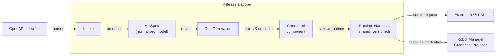

# REST Connector Roadmap

**Status:** Draft
**Basis:** RestCodeGenerator prototype (this repository's `tools/RestCodeGenerator`)
**Scope:** Release 1 detailed; Releases 2–8 outlined

A phased plan for importing external REST APIs into Robot Studio as typed, callable components — OpenAPI/Swagger first, with the first confirmed use case being API key auth against an OpenAPI-described API. This document is for a different product (direct inclusion in Pega RPA / Robot Studio itself), tracked here because it's informed by, and builds on, the RestCodeGenerator prototype in this repository. See [`EXECUTIVE_BRIEF.md`](EXECUTIVE_BRIEF.md) for the one-page leadership version, [`PRD_REST_API_COMPONENT.md`](PRD_REST_API_COMPONENT.md) for the original full-scope product spec this roadmap phases out, and [`PUSHBACK_BRIEF.md`](PUSHBACK_BRIEF.md) for the review prep notes.

## 1. Architecture

Three layers, each independently shippable: **Intake** turns a source definition into one normalized model; **DLL Generation** turns that model into a thin, typed component; the **Runtime Harness** is the shared, versioned assembly every generated component calls into at runtime. The Harness carries all HTTP execution, auth, and credential-resolution logic — a generated component never contains its own copy of it.



> Design-time pipeline (left) turns a spec into a thin generated component; at runtime that component's methods call the shared Runtime Harness, which sends the request and resolves credentials through Robot Manager's existing provider chain (ASOManager / Credential Store / BeyondTrust / CyberArk). The boxed region marks what Release 1 builds — the target API and Robot Manager's credential system are existing infrastructure this plugs into, not new work.

**Load-bearing constraint:** the Harness's public contract — the request-descriptor shape, the auth-config shape, the execution entry point — is what every generated component depends on for the life of that component. It has to be designed and frozen as a versioned contract *before* Release 1 ships, not discovered afterward: a Harness upgrade should never require regenerating a component that's already deployed.

## 2. Release 1 — OpenAPI / Swagger

Ships all three layers end to end for one import format, with auth narrowed to Basic, Bearer, and API key — the three schemes with no token lifecycle to manage, which keeps the Harness's first version small. Responses stay raw JSON, consumed via Robot Studio's existing JSON Parser Component. Explicitly excludes: typed response helpers (Release 2 — the first fast-follow, since it directly completes this release's own use case), OAuth2 client-credentials and Microsoft Entra ID (Release 3, not blocked on anything new), Postman/Bruno/curl import (Release 4), the manual endpoint wizard (Release 5), interactive OAuth2 flows and certificate-based auth (Release 6), visual response mapping (Release 7), and regeneration diffing (Release 8) — each sequenced on purpose rather than omitted by accident.

### 2.1 Intake — `200 · Release 1`

`OpenAPI / Swagger → ApiSpec`

**Scope:**
- Parse Swagger 2.0 and OpenAPI 3.x, JSON and YAML
- Resolve `$ref` (simple pointer names; documented limitation on JSON-Pointer escapes)
- Extract path / query / header parameters and JSON request bodies; non-JSON bodies are skipped and explicitly reported, never silently dropped
- Extract declared security schemes into normalized kinds — basic, bearer, API key (header/query), OAuth2 client-credentials, unsupported
- Extract `info` metadata (title, version, description, contact, license) for generated documentation
- Produce a normalized, serializable `ApiSpec` artifact, persisted for later regeneration

**Acceptance criteria:**
- A real-world OpenAPI 3.x spec produces one operation per usable endpoint; skipped operations are listed, not dropped
- A templated or relative server URL never produces a false concrete base URL
- Malformed or partial metadata degrades to nulls — Intake never throws on well-formed-but-incomplete input

### 2.2 DLL Generation — `200 · Release 1`

`ApiSpec → compiled component`

**Scope:**
- One typed method per operation: scalar parameters for path/query/header, JSON bodies flattened into typed parameters where the schema names fields, raw fallback otherwise
- Deterministic naming from `operationId` (verb+path fallback), collision suffixing, and a reserved-name list so generated members never collide with the harness contract's own names
- Design-time properties: `BaseUrl`, `TimeoutSeconds`, and per-scheme credential properties (literal value or credential-reference — see 2.3)
- Each method builds a request descriptor and hands it to the harness — **no** HTTP, auth, or JSON logic lives in generated code
- Wiring into the platform's confirmed compile-and-reference mechanism

**Acceptance criteria:**
- Every generated method's designer-visible signature uses only Robot Studio–selectable primitive types
- Two operations that would otherwise produce identical selectable signatures are disambiguated automatically
- Regenerating from an unchanged spec produces behavior-identical output

### 2.3 Runtime Harness — `200 · Release 1`

`request + auth config → HTTP call, raw response`

**Scope:**
- HTTP execution: timeout/cancellation, response capture, transport-failure vs. HTTP-status distinction
- Auth strategies: Basic, Bearer, API key (header/query) — no token lifecycle to manage for any of the three. *OAuth2 client-credentials and Entra ID follow in Release 3, designed against the same extension point.*
- Credential resolution: a literal value, or a named credential-reference resolved through Robot Manager's existing provider chain — ASOManager, Credential Store, BeyondTrust, CyberArk, custom provider. **No new provider types in Release 1.**
- Request/response plumbing: query building, header assembly, path-parameter escaping, JSON body assembly from flattened parameters
- A frozen, versioned public contract that generated components compile against long-term, with an auth-strategy extension point that Release 3's OAuth2 work plugs into without a contract break

**Acceptance criteria:**
- A harness fix or new capability ships without regenerating any already-deployed component
- Every execution path returns a never-throw result — a success flag plus message, matching the platform's existing convention
- Basic, Bearer, and API key (header and query) all authenticate correctly against a real external API

### Auth coverage across releases

| Scheme | Mechanism | Attended / unattended | Release |
|---|---|---|---|
| Basic | username + password header | Both | `200 · R1` |
| Bearer | static token | Both | `200 · R1` |
| API key | named header or query param | Both | `200 · R1` |
| OAuth2 client-credentials | token endpoint, cached + refreshed | Both — non-interactive | `202 · R3` |
| Microsoft Entra ID (app-only) | OAuth2 client-credentials + scope | Both — non-interactive | `202 · R3` |
| Auth-code+PKCE, device code, delegated Entra ID | requires interactive consent | Attended only | `501 · R6` |
| Client certificates (mTLS, Entra cert credential) | provisioned cert, no interaction at call time | Both — non-interactive | `501 · R6` |

### Response handling across releases

| Capability | Mechanism | Release |
|---|---|---|
| Raw response | JSON/text string, consumed via Robot Studio's native JSON Parser Component | `200 · R1` |
| Typed helpers | strict + safe GetX/ReadX API, JSONPath-style traversal | `202 · R2` |
| Visual mapping | designer editor binding response fields to named outputs | `501 · R7` |

### Harness contract sketch (Release 1)

A small, closed set of types plus one entry point. Generated code only ever builds a `RestRequest` and hands it to the executor — no HTTP, no auth, nothing that changes shape when the Harness is patched.

```csharp
// What a generated method builds
public sealed class RestRequest
{
    public string HttpMethod { get; init; }
    public string PathTemplate { get; init; }              // "/pet/{petId}"
    public IReadOnlyDictionary<string,string> PathParameters { get; init; }
    public IReadOnlyList<KeyValuePair<string,string>> QueryParameters { get; init; }
    public IReadOnlyList<KeyValuePair<string,string>> Headers { get; init; }
    public string BodyJson { get; init; }                  // null when there's no body
}

// Populated once from design-time properties, reused across calls
public sealed class RestConnection
{
    public string BaseUrl { get; set; }
    public int TimeoutSeconds { get; set; } = 30;
    public RestAuthConfig Auth { get; set; }
}

// Closed hierarchy — Release 1 ships three; Release 2 adds a fourth, additively
public abstract class RestAuthConfig { }
public sealed class BasicAuthConfig : RestAuthConfig
{
    public RestCredentialValue Username;
    public RestCredentialValue Password;
}
public sealed class BearerAuthConfig : RestAuthConfig { public RestCredentialValue Token; }
public sealed class ApiKeyAuthConfig : RestAuthConfig
{
    public string Name;
    public RestCredentialValue Value;
    public ApiKeyLocation Location;      // Header | Query
}

// Literal-or-reference union — the "expansion to external providers" piece
public readonly struct RestCredentialValue
{
    public static RestCredentialValue Literal(string value) => /* ... */;
    public static RestCredentialValue FromCredentialReference(string applicationKey) => /* ... */;
    // resolved internally: a reference calls Robot Manager's existing provider chain
    // (ASOManager / Credential Store / BeyondTrust / CyberArk) — a literal passes through
}

// Never-throw result, matching the platform convention
public sealed class RestResult
{
    public bool Success { get; init; }
    public int StatusCode { get; init; }
    public string ResponseBody { get; init; }
    public string Message { get; init; }   // null on success
}

// The one thing generated code calls
public interface IRestExecutor
{
    RestResult Execute(RestRequest request, RestConnection connection);
}
```

A generated method, in full:

```csharp
public bool GetPetById(string petId, out string responseJson, out int statusCode, out string message)
{
    var request = new RestRequest {
        HttpMethod = "GET",
        PathTemplate = "/pet/{petId}",
        PathParameters = new Dictionary<string,string> { ["petId"] = petId },
    };
    var result = _executor.Execute(request, _connection);
    responseJson = result.ResponseBody;
    statusCode = result.StatusCode;
    message = result.Message;
    return result.Success;
}
```

`RestAuthConfig` is a sealed-per-scheme class hierarchy rather than a string-keyed bag, so Release 2 adds `OAuth2ClientCredentialsAuthConfig` as a new subclass with zero contract break — the Harness pattern-matches on concrete type to pick a strategy. `IRestExecutor` is an interface, not a static entry point, so a generated component's tests can substitute a fake executor instead of hitting a real network, and a future breaking change can ship as `IRestExecutor2` alongside the original rather than forcing a flag day. Every type only ever gains members going forward — that's the concrete mechanism behind "a Harness upgrade never requires regenerating a deployed component."

### Cross-cutting concerns

**Harness contract versioning.** The request-descriptor shape, the auth-config shape, and the execute entry point form a long-lived public API. Freeze it, version it, and commit to additive-only changes (or a clean major-version break with a migration story) before Release 1 ships — generated components compiled today have to keep working against harness versions shipped years from now.

**Credential-reference model.** Robot Manager's existing application-credential lookup already resolves an arbitrary named key through DPAPI/BeyondTrust/CyberArk/custom providers today — that's an existing capability, not new infrastructure. Release 1 only needs to (a) let a generated property accept a credential-reference key alongside its literal-value form, and (b) decide whether "REST API credential" becomes its own named category in that lookup, or reuses the generic application-credential bucket.

## 3. Releases 2–8

Each later release targets the same `ApiSpec` model or the same harness extension points established in Release 1 — none of them require re-opening Intake, Generation, or the harness's core contract. Releases 2/3 and 4/5 are each parallel-track pairs — neither member of a pair depends on the other, both depend only on Release 1.

### R2 — Typed response helpers: strict + safe JSON helper API

A helper API on the raw response — throwing `GetString`/`GetInt32`/… and never-throw `ReadString`/`ReadInt32`/… twins — with JSONPath-style traversal, culture-independent type conversion, and a defined error taxonomy. Library only: no UI, no new import format, no auth work.

*Depends on:* Release 1's raw-JSON `RestResult`, unchanged. *Why here:* unlike OAuth2/Entra (Release 3), this directly completes Release 1's *own* confirmed use case — API key + OpenAPI still needs its responses consumed by something better than a raw string, where OAuth2 instead serves APIs outside that first use case entirely. Parallel-track candidate with Release 3.

### R3 — OAuth2 & Entra ID: client-credentials auth, fast-follow

Extends the Harness's auth strategies with OAuth2 client-credentials — token caching, automatic refresh, and an optional scope parameter, which Microsoft Entra ID's v2.0 token endpoint requires to accept the request at all. No new import formats, no wizard, no interactive flows.

*Depends on:* Release 1's auth-strategy extension point. *Why here:* non-interactive by default, same as Basic/Bearer/API key — works in both attended and unattended execution, so it doesn't need the attended/unattended platform decision that gates Release 6's interactive flows. Parallel-track candidate with Release 2.

### R4 — Import formats: Postman, Bruno, curl

Three new parsers, each producing the same `ApiSpec` — zero changes to Generation or the Harness.

*Depends on:* Release 1's ApiSpec model, unchanged. *Why here:* lowest marginal cost once the normalized model exists — a proven, low-risk pattern that expands reach quickly.

### R5 — Manual wizard: guided endpoint definition, no import file

A step-by-step designer flow that produces the same `ApiSpec` shape as any import path.

*Depends on:* Release 1's ApiSpec + Generation. *Why here:* independent of import-format breadth — can run in parallel with Release 4 on a separate track; the largest UI investment after the core pipeline is proven.

### R6 — Extended auth: interactive flows and certificates

Two different things, bundled here for scope: authorization-code + PKCE, device-code, and Entra ID delegated auth all require interactive consent, so they're attended-only. Client certificates (mTLS, Entra certificate credential) don't require interaction at call time — they just need to be provisioned — so they work in both attended and unattended execution, same as Release 3's schemes.

*Depends on:* the Harness's auth-strategy extension point, established in Release 1 and extended in Release 3. *Why here:* the interactive flows need a platform decision — which of them apply to attended vs. unattended robots — that neither Release 1 nor Release 3 had to make, since everything shipped by then is non-interactive. Certificates don't depend on that decision; they're grouped here on scope, not on the gating rule.

### R7 — Visual mapping: response fields → named automation outputs

A designer editor that maps response fields to named outputs by clicking through a sample response — generating bindings on top of Release 2's helper API rather than requiring hand-written paths.

*Depends on:* Release 2's typed helper API and path syntax. *Why here:* the UI-level counterpart to Release 2's library — a full designer feature with no library-level dependency forcing it earlier, best scoped once Release 2's helper API has real usage to inform what the editor should expose.

### R8 — Regeneration: diffing, breaking-change review, manifests

Change detection between spec versions, a review step before replacing a component's signature set, and artifact fingerprinting.

*Depends on:* a real population of generated, deployed components. *Why here:* only matters at scale — protects against regressions once regeneration is routine rather than a one-time event.

## 4. Non-functional requirements

Cross-cutting concerns that don't show up in a per-operation acceptance test, but decide whether Release 1 actually works in a real deployment.

### 4.1 Outbound proxy support — `200 · R1 scope`

Robot Runtime environments are frequently deployed behind a corporate outbound proxy. The Harness must default to honoring the host machine's configured system proxy — matching how other network-capable Robot Studio components already behave — and expose an explicit per-connection override for environments where the automatic setting doesn't apply.

Silently ignoring the system proxy turns into a failure that looks like a broken generated component, not a network configuration gap — exactly the kind of defect that only surfaces once a pilot customer's locked-down network is involved.

### 4.2 TLS / certificate validation policy — `200 · R1 scope`

**Default:** standard TLS certificate validation, no exceptions. **Escape hatch:** an explicit, visibly-named connection setting to relax validation for internal or self-signed endpoints during development against internal APIs — never a silent global switch.

Worth making the relaxed setting visually distinct in the designer and logged at runtime, so a reviewer can spot a production automation that shipped with certificate validation disabled, rather than it surviving unnoticed.

### Additional operational requirements

- **HttpClient lifecycle at shared-harness scale.** One Harness now serves every generated component on a robot, not one client per file — needs a deliberate connection-pooling strategy rather than inheriting the prototype's one-client-per-file pattern, to avoid socket exhaustion under many concurrent generated components.
- **Conformance fixture suite.** A small, versioned set of real-world OpenAPI specs that Intake, Generation, and the Harness run against on every change, so "regenerating produces identical output" is a checked fact, not a claim.
- **Security review gate.** A mandatory review before Release 1 ships — it handles credentials and makes outbound calls to arbitrary external hosts, the profile that gets a formal review at most platform shops.
- **Published compatibility matrix.** Which OpenAPI/Swagger versions and schema features are actually supported, shipped as part of Release 1 documentation rather than discovered through support tickets.

## 5. Open decisions

Needed before or alongside Release 1 — none block starting Intake or Generation work, but all five block calling Release 1 finished.

1. **Harness contract & versioning policy.** Exact shape of the request-descriptor and auth-config types, and the compatibility rule generated components can rely on.
2. **Credential taxonomy.** Whether "REST API credential" is a new named category in Robot Manager's provider lookup, or reuses the existing generic application-credential bucket.
3. **Attended/unattended gating rule.** A single rule the platform applies from Release 6 onward to decide which *interactive* auth flows (authorization-code+PKCE, device-code, delegated Entra ID) are offered in which execution context — needed once, reused for every future interactive flow. Non-interactive schemes (Basic/Bearer/API key/OAuth2 client-credentials/Entra app-only) and certificate-based auth work in both contexts already and don't need this rule.
4. **Error-handling model.** Whether Release 1 commits to never-throw only (matching the RestCodeGenerator prototype) or needs a configurable `ErrorBehavior` — return a failed result vs. throw an exception — as the original product spec called for. This touches the frozen `RestResult` contract directly, so it needs to be settled now rather than reopened after Release 1 ships.
5. **Harness rollout discipline.** The same "patch once, every component benefits" property that makes the shared Harness valuable also means a defective Harness release now affects every deployed REST component at once. Needs a canary/staged-rollout policy riding the existing Synchronization Server distribution mechanism, not a flat ship-to-everyone release.

---

Informed by a working prototype — a standalone OpenAPI/Postman/Bruno/curl code generator built and shipped against the same normalized-model approach described here (`tools/RestCodeGenerator` in this repository). Exact contracts, property names, and sequencing remain subject to platform-team review.
